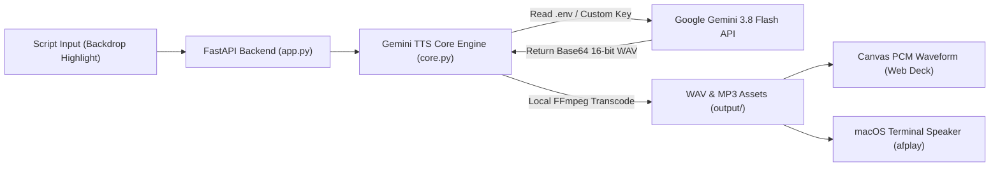

<div align="center">
  
# 🎙️ Gemini TTS Deck

**A Professional, Hyper-Realistic Text-to-Speech (TTS) Recording Console powered by Google Gemini 3.8 Flash TTS**

[](https://www.python.org/)
[](https://github.com/astral-sh/uv)
[](https://fastapi.tiangolo.com/)
[](https://ai.google.dev/)
[](https://linux.do)
[](./LICENSE)

[English](./README.md) · [简体中文](./README_zh.md) · [LINUX DO Community](https://linux.do) · [Contributing](./CONTRIBUTING.md) · [Changelog](./walkthrough.md)

<br/>

<div align="center">


https://github.com/user-attachments/assets/c9e855c8-9433-4bbb-9af0-ffa5fb543723


</div>

</div>

---

## 🌟 Design Highlights & Features

- **🎛️ Classic 5-Step Recording Deck Workflow**:
  Paying homage to industrial audio hardware design (such as Braun and Teenage Engineering), the workflow follows a clean, intuitive pipeline: `01 Script` ➔ `02 Voice` ➔ `03 Style` ➔ `04 Model` ➔ `05 Takes (History)`.
- **📜 Dual-Layer Script Backdrop Highlighter**:
  Combines an underlying `<mark>` highlight layer with a seamless, transparent native `<textarea>`. It preserves native IME typing, undo/redo, and cursor smoothness, while semi-transparently highlighting micro-expression tags (`<laugh>`, `<sigh>`, `<whisper>`, `<gasp>`, `<pause>`). Styled with elegant serif typography for an immersive studio feel.
- **📊 Native 16-Bit PCM Binary Waveform Visualizer**:
  **Zero third-party audio library dependencies**. A lightweight, client-side `readPcmWav` parser extracts 16-bit PCM binary samples from RIFF WAV headers via `DataView`, rendering an interactive 600-point physical soundwave on `<canvas>` with click-to-seek playback support.
- **🎚️ Docked Bottom Transport Bar**:
  A floating control bar featuring large play/pause toggles, active voice & script indicator, synchronized waveform seekhead, timecode displays, multi-speed playback (`1.0×`, `1.25×`, `1.5×`, `0.8×`), one-click text copying, and dual-format downloads.
- **👥 Symmetrical 4 Male + 4 Female Preset Voices**:
  Curated collection of 8 premier Gemini voices—strictly organized into **4 Male voices (Puck, Charon, Fenrir, Zephyr) and 4 Female voices (Aoede, Kore, Veda, Leda)** for balanced visual symmetry and swift auditioning.
- **📦 Dual Format Export (Lossless WAV + Compact MP3)**:
  Directly outputs broadcast-quality 24kHz/16-bit RIFF WAV files, with automatic, lightning-fast on-the-fly local FFmpeg transcoding to 192kbps MP3 for universal device compatibility.
- **🏷️ Date-First Standardized File Naming**:
  Format: `{YYYYMMDD_HHMMSS}_{Voice}_{CleanSnippet}.{wav|mp3}` (e.g., `20260930_195000_Puck_WelcomeToGemini.mp3`). Natural chronological sorting in file explorers, without redundant prefixes and stripped of special emotion tags.
- **🌓 Adaptive Dual-Color Themes**:
  Native CSS variable-driven styling with `Auto (system)`, `Light`, and `Dark` modes. Dynamic redraw updates the Canvas soundwave colors automatically.
- **⌨️ High-Efficiency Keyboard Shortcuts**:
  - `⌘ + Enter` (macOS) / `Ctrl + Enter` (Windows/Linux): Generate speech instantly;
  - `Space` (when not focused on text input): Play/pause current audio.
- **⏱️ Live Generation Stopwatch**:
  The generate button pulses with a breathing recording indicator and a real-time elapsed timer (`0.0s`, `1.1s`...) to measure Gemini's rapid synthesis speed.

<p align="center">
  
  
</p>

---

## 🏗️ Architecture Overview



---

## 👥 Voice Reference Table (4+4 Symmetrical)

### 👨 Male Voices (4 Presets)
| Voice ID | Personality & Acoustic Profile | Recommended Scenarios |
| :--- | :--- | :--- |
| **Puck** *(Default)* | Crisp, lively, relatable, articulate | Video commentaries, everyday dialogues, virtual assistants, vlogs |
| **Charon** | Deep, magnetic, cinematic, gravelly resonance | Movie trailers, epic narratives, documentaries, audiobooks |
| **Fenrir** | Authoritative, commanding, deep, formal | News broadcasts, corporate keynote presentations, executive briefs |
| **Zephyr** | Bright, youthful, energetic, optimistic | Anime/gaming characters, youth fiction, cheerful explainer videos |

### 👩 Female Voices (4 Presets)
| Voice ID | Personality & Acoustic Profile | Recommended Scenarios |
| :--- | :--- | :--- |
| **Aoede** | Warm, elegant, emotive, expressive | Lyrical prose, poetry readings, emotional podcasts, storytelling |
| **Kore** | Gentle, soothing, peaceful, calming | Bedtime stories, sleep meditation, slow-paced essays |
| **Veda** | Intellectual, clear, objective, articulate | Educational tutorials, academic lectures, audio courses |
| **Leda** | Graceful, composed, steady, narrative cadence | Serialized novels, biographies, deep narrative literature |

---

## 🎭 Emotional & Micro-Expression Syntax

Insert micro-expression tags anywhere within your script text to guide Gemini's natural performance shifts:

| Tag Syntax | Expressive Action | Example Script |
| :--- | :--- | :--- |
| `<laugh>` | Natural laughter / chuckle | `"I really didn't expect to see you here! <laugh> What a coincidence."` |
| `<sigh>` | Gentle sigh | `"The night deepens, and the city falls quiet. <sigh> It has been a long day."` |
| `<whisper>` | Intimate whisper | `"Let me tell you a secret, <whisper> don't let anyone else hear this."` |
| `<gasp>` | Sudden sharp intake of breath | `"Oh my gosh! <gasp> Look at what just happened over there!"` |
| `<pause>` | Deliberate emotional pause | `"The truth has been here all along, <pause> we just never stopped to notice."` |

---

## 🚀 1-Minute Quickstart

### 1. Clone the Repository
```bash
git clone https://github.com/wanxiao2018/gemini-tts-deck.git
cd gemini-tts-deck
```

### 2. Environment Setup (Recommended: `uv`)
```bash
# macOS / Linux (via curl)
curl -LsSf https://astral.sh/uv/install.sh | sh

# Windows (via PowerShell)
powershell -ExecutionPolicy ByPass -c "irm https://astral.sh/uv/install.ps1 | iex"

# Synchronize virtual environment in project directory
uv venv .venv
uv pip install -e .
```
*(Optional for MP3 export)*: Install FFmpeg via `winget install Gyan.FFmpeg` (Windows) or `brew install ffmpeg` (macOS).

### 3. Configure Gemini API Key
```bash
cp .env.example .env
```
Open `.env` and insert your [Google AI Studio API Key](https://aistudio.google.com/app/apikey):
```env
GEMINI_API_KEY="your_gemini_api_key_here"
```
*(Note: You can also launch without an environment variable and input your key in the web console's settings modal; it is kept strictly in local browser storage).*

### 4. Launch the Recording Deck
- **Windows (One-Click)**: Simply double-click **`run.bat`**! It will verify your `uv` environment and automatically open your browser.
- **macOS / Linux / Terminal**:
```bash
uv run python run.py
```
> The launcher will automatically start Uvicorn and open your default browser at `http://127.0.0.1:8000`.
> Shortcut hint: Type your script and hit **`⌘ + Enter`** (Mac) or **`Ctrl + Enter`** to synthesize instantly!

---

## 💻 CLI Terminal Usage

Designed for power users, scripting pipelines, and direct audio generation:

```bash
# 1. Synthesize text and play immediately (macOS native afplay)
uv run python cli.py "Hello, welcome to Gemini TTS Deck." --play

# 2. Select female voice Aoede and export to MP3
uv run python cli.py "Stars don't struggle to shine; they just do." -v Aoede -o star.mp3 --play

# 3. Specify cinematic voice Charon with a style directive
uv run python cli.py "At the edge of the universe, time stands still." -v Charon -s "deep cinematic voiceover" --play

# 4. Synthesize text directly from a file
uv run python cli.py -f chapter1.txt -o chapter1.wav

# 5. List all available voices and descriptions
uv run python cli.py --list-voices
```

---

## 📁 Repository Structure

```text
gemini_tts_app/
├── .venv/               # Isolated virtual environment managed by uv (git-ignored)
├── .env.example         # Environment template for API keys
├── .gitignore           # Git ignore rules (protecting secrets and output audio)
├── LICENSE              # MIT Open Source License
├── CONTRIBUTING.md      # Contribution guidelines
├── README.md            # English homepage (Default GitHub document)
├── README_zh.md         # Full Chinese documentation
├── pyproject.toml       # Python project metadata and packaging configuration
├── core.py              # Core synthesis engine, .env loader, FFmpeg transcoding & history
├── app.py               # FastAPI backend with static routes & audio endpoints
├── cli.py               # Standalone terminal CLI tool (cross-platform audio playback)
├── run.py               # One-click service launcher with browser opener
├── run.bat              # Windows one-click batch launcher (double-click to run)
├── docs/
│   ├── demo.mp4         # High-definition screen recording with sound (442KB)
│   ├── screenshot-dark.png   # Dark mode recording deck interface
│   └── screenshot-light.png  # Light mode recording deck interface
├── static/
│   └── index.html       # Industrial Gemini TTS Recording Deck single-page frontend
└── output/
    └── .gitkeep         # Local audio output directory
```

---

## 🐧 Community & Acknowledgements

This project acknowledges and is shared with the **[LINUX DO](https://linux.do)** community.
- Community portal: [https://linux.do](https://linux.do)
- Community members are warmly welcomed to discuss, give feedback, and share their experiences on LINUX DO.
- Join discussions on prompt engineering, emotional tags, and future audio features!

---

## 🤝 Contributing

Contributions, issues, and feature requests are welcome!
Please check the [CONTRIBUTING.md](./CONTRIBUTING.md) guide for guidelines on PRs and local development.

---

## 📄 License

This project is open-sourced under the [MIT License](./LICENSE). Feel free to use it for personal and commercial applications.
