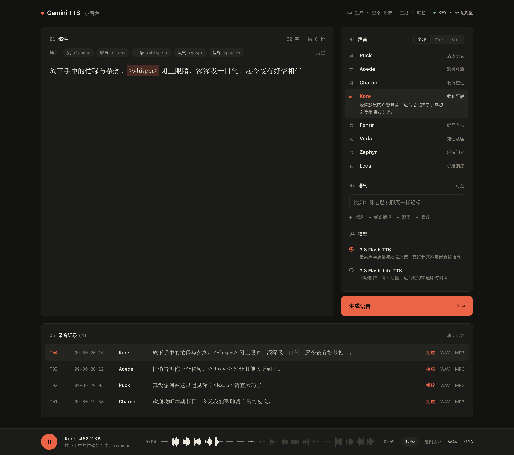
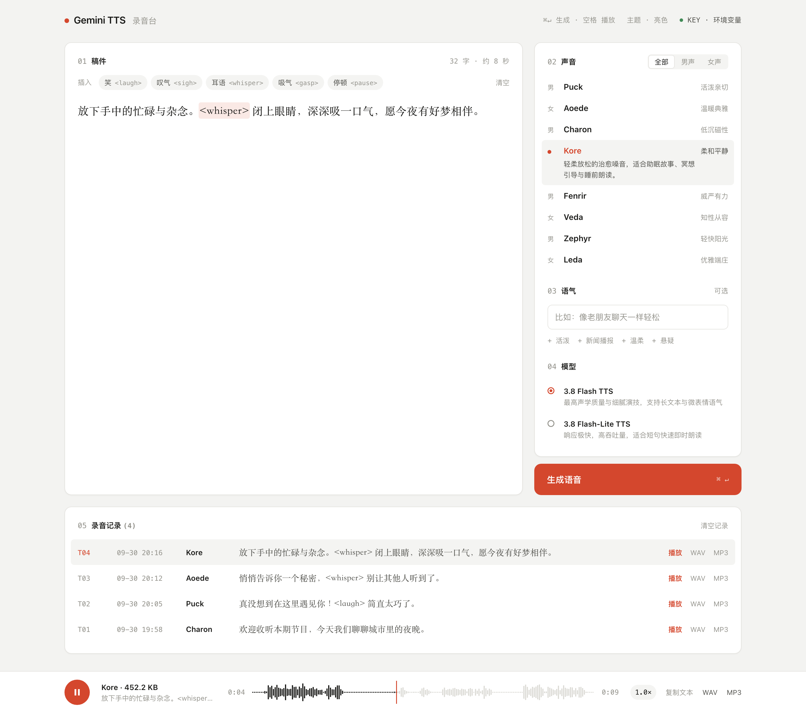
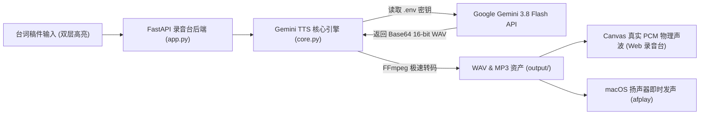

<div align="center">

# 🎙️ Gemini TTS Deck

**基于 Google Gemini 3.8 Flash TTS 的专业级拟真文本转语音（Text-to-Speech）开源录音控制台**

[](https://www.python.org/)
[](https://github.com/astral-sh/uv)
[](https://fastapi.tiangolo.com/)
[](https://ai.google.dev/)
[](https://linux.do)
[](./LICENSE)

[English](./README.md) · [简体中文](./README_zh.md) · [LINUX DO 社区](https://linux.do) · [贡献指南](./CONTRIBUTING_zh.md) · [更新日志](./walkthrough.md)

<br/>

<div align="center">

https://github.com/user-attachments/assets/c9e855c8-9433-4bbb-9af0-ffa5fb543723

</div>

</div>

---

## 🌟 录音台设计精髓与亮点

- **🎛️ 经典录音台五步工序流**：
  致敬经典音频硬件设备（如 Braun、Teenage Engineering）的工业设计美学，构建了 `01 稿件` ➔ `02 声音` ➔ `03 语气` ➔ `04 模型` ➔ `05 录音记录 (Takes)` 的心智工序，动线清晰纯粹。
- **📜 双层高亮台词稿框（Backdrop Highlighter）**：
  底层高亮渲染 + 顶层透明原生输入框重叠，既保留原生输入法撤销与顺滑光标体验，又能将正文中的微表情标签（`<laugh>`, `<sigh>`, `<whisper>`, `<gasp>`, `<pause>`）半透明高亮展示；配合沉浸式 **宋体衬线家族（Songti SC / Noto Serif）** 与舒展行高，宛如置身专业演播室。
- **📊 纯手写二进制 PCM 真实声波（Canvas Visualizer）**：
  **零依赖第三方音频库**，纯原生手写 `readPcmWav` 通过 `DataView` 毫秒级解构 RIFF WAV 的 16-bit PCM 真实二进制采样帧，并在 `<canvas>` 上绘制 600 点物理高低声波柱，支持点击任意位置精确定位播放（Seek）。
- **🎚️ 吸附式底部常驻播控台（Transport Bar）**：
  全局悬浮底栏，集成大号播放/暂停按钮、正在播放音色与文案、真实声波走针、时间码显示、多档倍速（`1.0×`, `1.25×`, `1.5×`, `0.8×`）、一键复制文案与双格式下载。
- **👥 4+4 男女声极对称精选**：
  精选 8 款最具代表性的官方预置音色，**男声 4 款（Puck, Charon, Fenrir, Zephyr）与女声 4 款（Aoede, Kore, Veda, Leda）严格对齐**，支持分类切换与选中展开介绍。
- **📦 双格式导出 (无损 WAV + 通用 MP3)**：
  原生输出广播级带 RIFF 头的高保真无损 WAV，同时服务端内置高性能 FFmpeg 极速自动转码生成 192kbps 轻量 MP3，兼顾音质母带与多端流通。
- **🏷️ 日期前置的人性化规范命名**：
  格式：`{年月日_时分秒}_{音色}_{文案摘要}.{wav|mp3}`（如 `20260930_195000_Puck_你好今天天气真好.mp3`），日期置前按时间天然排序，去除无意义前缀，自动过滤情绪标签。
- **🌓 全套自适应双色主题**：
  原生 CSS 变量驱动，支持 `自动（跟随系统）`、`亮色`、`暗色` 三档平滑切换，切换时 Canvas 物理声波柱色值自动重绘适配。
- **⌨️ 极速快捷键盲操**：
  - `⌘ + Enter`（Mac）/ `Ctrl + Enter`：一键触发生成；
  - `Space（空格键）`（非输入状态）：一键播放/暂停当前音频。
- **⏱️ 秒表生成计时器**：
  点击生成后，按钮红点呼吸闪烁，右侧实时跳动秒表计时（`0.0s`, `1.1s`...），直观展现 Gemini 语音合成速度。

<p align="center">
  
  
</p>

---

## 🏗️ 架构概览



---

## 👥 音色库速查表 (4+4 极对称排版)

### 👨 男声音色 (4 款)
| 音色名称 | 声音性格 / 标签 | 适用推荐场景 |
| :--- | :--- | :--- |
| **Puck** *(默认)* | 活泼亲切 · 清脆自然 · 日常通用 | 短视频解说、日常对话、交互式助手、生活 Vlog 配音 |
| **Charon** | 低沉磁性 · 成熟稳重 · 纪录片质感 | 电影大片旁白、史诗故事、悬疑解说、正剧朗读 |
| **Fenrir** | 威严有力 · 坚定深沉 · 严肃播报 | 新闻通告、商务发布会、严肃演播、企业宣传片 |
| **Zephyr** | 轻快阳光 · 朝气蓬勃 · 少年感 | 动漫游戏角色、青春故事、轻松科普 |

### 👩 女声音色 (4 款)
| 音色名称 | 声音性格 / 标签 | 适用推荐场景 |
| :--- | :--- | :--- |
| **Aoede** | 温暖典雅 · 富有感染力 · 情感充沛 | 抒情散文、诗歌朗诵、情感电台、有声书主角 |
| **Kore** | 柔和平静 · 治愈舒缓 · 睡前读物 | 睡前助眠故事、冥想引导、慢节奏散文 |
| **Veda** | 知性从容 · 专业清晰 · 知识科普 | 知识百科教程、学术讲座、专业有声课程 |
| **Leda** | 优雅端庄 · 娓娓道来 · 岁月静好 | 长篇小说连载、人物传记、深度纪实文学 |

---

## 🎭 情绪与微表情语法示例

在稿件任意位置点击工具栏或输入标签，Gemini 会在对应字句产生拟真的语气转变：

| 标签语法 | 动作效果 | 示例效果 |
| :--- | :--- | :--- |
| `<laugh>` | 自然笑声 | `"真没想到在这里遇见你！<laugh> 简直太巧了。"` |
| `<sigh>` | 轻轻叹气 | `"夜色渐深，喧嚣终归沉寂。<sigh> 又是漫长的一天。"` |
| `<whisper>` | 神秘耳语 | `"悄悄告诉你一个秘密，<whisper> 别让其他人听到了。"` |
| `<gasp>` | 抽气/倒吸气 | `"天哪！<gasp> 你看那边发生了什么！"` |
| `<pause>` | 情绪短暂停顿 | `"答案其实一直都在，<pause> 只是我们未曾察觉。"` |

---

## 🚀 1 分钟快速上手

### 1. 克隆代码仓库
```bash
git clone https://github.com/wanxiao2018/gemini-tts-deck.git
cd gemini-tts-deck
```

### 2. 准备运行环境 (推荐使用 uv)
```bash
# macOS / Linux 安装 uv (若尚未安装)
curl -LsSf https://astral.sh/uv/install.sh | sh

# Windows 安装 uv (PowerShell 单行命令)
powershell -ExecutionPolicy ByPass -c "irm https://astral.sh/uv/install.ps1 | iex"

# 在项目目录下同步虚拟环境
uv venv .venv
uv pip install -e .
```
*(可选：若需转码 MP3，Windows 可运行 `winget install Gyan.FFmpeg`，macOS 可运行 `brew install ffmpeg`)*

### 3. 配置 Gemini API 密钥
```bash
cp .env.example .env
```
打开 `.env` 填入您的 [Google AI Studio API Key](https://aistudio.google.com/app/apikey)：
```env
GEMINI_API_KEY="你的_GEMINI_API_KEY"
```
*(注：未配置环境变量也可以直接启动，在打开的录音台右上角点击设置输入密钥，仅保存在当前浏览器本地)*

### 4. 一键启动录音台
- **Windows 用户（一键双击）**：直接双击项目根目录下的 **`run.bat`** 即可，自动检测环境并弹出浏览器！
- **macOS / Linux / 命令行**：
```bash
uv run python run.py
```
> 服务启动后会自动唤起浏览器打开 `http://127.0.0.1:8000`。
> 快捷键提示：输入文本后，随时按下 **`⌘ + Enter`**（Mac）或 **`Ctrl + Enter`**（Windows）即可极速触发生成！非输入状态按 **`Space`** 即可暂停/播放。

---

## 💻 命令行 CLI 使用

本工具专为终端高频使用场景优化，支持管道重定向与快捷朗读：

```bash
# 1. 朗读文本并在电脑上发声播放 (macOS 原生 afplay)
uv run python cli.py "你好，欢迎使用 Gemini 开源文本转语音录音台。" --play

# 2. 指定女声音色 (如温暖感性的 Aoede) 并导出到指定 WAV/MP3 文件
uv run python cli.py "星光不问赶路人，时光不负有心人。" -v Aoede -o star.mp3 --play

# 3. 指定电影级男声 Charon 并附带风格描述
uv run python cli.py "在宇宙的边缘，时间停止了流动。" -v Charon -s "深邃低沉的电影旁白感" --play

# 4. 从文本文件直接合成有声读物
uv run python cli.py -f chapter1.txt -o chapter1.wav

# 5. 查看所有可用音色与详细特性
uv run python cli.py --list-voices
```

---

## 📁 目录规范

```text
gemini_tts_app/
├── .venv/               # uv 隔离的虚拟环境 (已纳入 .gitignore)
├── .env.example         # 环境变量示例
├── .gitignore           # Git 忽略规范 (保护临时音频、密钥与备份)
├── LICENSE              # MIT 开源许可证
├── CONTRIBUTING.md      # 贡献开发指引
├── README.md            # 英文主页文档 (GitHub 默认加载)
├── README_zh.md         # 中文完整版说明文档
├── pyproject.toml       # Python 项目标准配置文件
├── core.py              # 核心合成逻辑、.env 加载器、FFmpeg 转码与历史持久化
├── app.py               # FastAPI 网页后端服务与静态路由
├── cli.py               # 命令行独立调用工具 (全平台发声支持)
├── run.py               # 一键启动服务并唤起浏览器 (多端通用)
├── run.bat              # Windows 用户专属一键双击启动脚本
├── docs/
│   ├── demo.mp4         # 录屏原片带声音演示 (442KB)
│   ├── screenshot-dark.png   # 暗色录音台界面截图
│   └── screenshot-light.png  # 亮色录音台界面截图
├── static/
│   └── index.html       # 经典工业风 Gemini TTS 录音台单页 (双层高亮 + Canvas 物理声波)
└── output/
    └── .gitkeep         # 音频生成输出目录
```

---

## 🐧 社区与致谢

本项目认可并链接 **[LINUX DO (linux.do)](https://linux.do)** 社区。欢迎佬友在 L 站讨论、反馈和分享使用体验。
- 社区交流主站：[https://linux.do](https://linux.do)
- 欢迎交流各类音色的微表情 Prompt 调优心得与配音技巧；
- 欢迎提出 Feature Request，共同打造好玩的开源语音工具；
- 秉持「真诚、友善、团结、专业」的精神，共同推动开源 AI 工具演进。

---

## 🤝 参与贡献

我们非常欢迎社区开发者的参与与建议！
请参阅 [CONTRIBUTING_zh.md](./CONTRIBUTING_zh.md) 了解如何提交 Issue、PR 规范以及本地调试指南。

---

## 📄 开源许可证

本项目基于 [MIT License](./LICENSE) 协议完全开源，可自由商用与个人学习使用。
